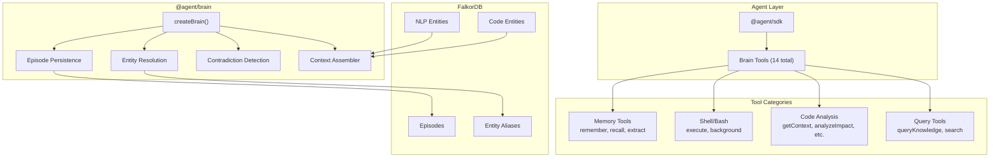
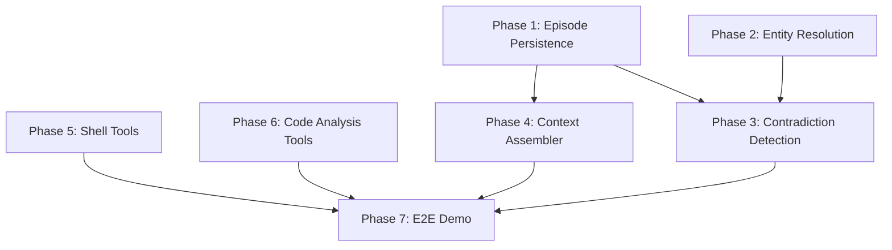

# Comprehensive Brain Enhancement Plan (Revised)

## Objective

Implement all remaining features for `@agent/brain` to create a fully persistent, self-improving agent brain with advanced memory, entity resolution, shell access, and rich tooling. **Maximize code reuse from codebase-graph project.**

---

## Architecture Overview



---

## Phase 1: Episodic Memory Persistence

**Goal:** Store episodes in FalkorDB so memories survive restarts

### Tasks

| Task | Description | Files | Source |
|------|-------------|-------|--------|
| 1.1 | Add Episode node schema (MERGE query) | `brain/src/graph/operations.ts` | New |
| 1.2 | Add Experience node schema | `brain/src/graph/operations.ts` | New |
| 1.3 | Add MENTIONS, ABOUT relationship types | `brain/src/graph/operations.ts` | New |
| 1.4 | Update `brain.remember()` to persist via graph ops | `brain/src/brain.ts` | Modify |
| 1.5 | Update `brain.recall()` to query graph with full-text | `brain/src/brain.ts` | Modify |
| 1.6 | Add full-text index on Episode.content | `brain/src/graph/client.ts` | Add to ensureIndexes() |
| 1.7 | Add `brain.recordEpisode()` persistence | `brain/src/brain.ts` | Modify |
| 1.8 | Unit tests for persistence | `brain/src/brain.test.ts` | New |

### Cypher Templates to Add

```cypher
UPSERT_EPISODE: `
  MERGE (e:Episode {id: $id})
  SET e.timestamp = $timestamp,
      e.type = $type,
      e.summary = $summary,
      e.content = $content,
      e.context_project = $contextProject,
      e.context_task = $contextTask,
      e.entities = $entities,
      e.relationships = $relationships
  RETURN e
`

RECALL_EPISODES: `
  MATCH (e:Episode)
  WHERE e.content CONTAINS $query OR e.summary CONTAINS $query
  RETURN e
  ORDER BY e.timestamp DESC
  LIMIT $limit
`

LINK_EPISODE_ENTITY: `
  MATCH (e:Episode {id: $episodeId})
  MATCH (entity {name: $entityName})
  MERGE (e)-[:MENTIONS]->(entity)
`
```

---

## Phase 2: Entity Resolution

**Goal:** Deduplicate entities like "OpenClaw" vs "openclaw" vs "Open Claw"

### Tasks

| Task | Description | Files | Source |
|------|-------------|-------|--------|
| 2.1 | Create entity-resolution.ts module | `brain/src/nlp/entity-resolution.ts` | New |
| 2.2 | Implement string normalization | Same | New |
| 2.3 | Implement Jaro-Winkler similarity | Same | New |
| 2.4 | Add ALIAS_OF relationship to schema | `brain/src/graph/operations.ts` | Add query |
| 2.5 | Add EntityAlias node type | `brain/src/graph/schema.ts` | Add |
| 2.6 | Implement `findSimilarEntities()` | `brain/src/nlp/entity-resolution.ts` | New |
| 2.7 | Implement `mergeEntities()` | Same | New |
| 2.8 | Add `brain.resolveEntity()` public method | `brain/src/brain.ts` | Add |
| 2.9 | Auto-resolve on `brain.extract()` | `brain/src/brain.ts` | Modify |
| 2.10 | Unit tests | `brain/src/nlp/entity-resolution.test.ts` | New |

### Resolution Types (from existing temporal.ts)

```typescript
// Already defined in types/temporal.ts - use as-is
type EntityResolution = {
  canonicalId: string;
  canonicalName: string;
  aliases: Array<{
    alias: string;
    source: string;
    confidence: number;
  }>;
  mergedFrom: string[];
  lastUpdated: string;
};
```

---

## Phase 3: Contradiction Detection

**Goal:** Flag and resolve conflicting facts

### Tasks

| Task | Description | Files | Source |
|------|-------------|-------|--------|
| 3.1 | Create contradiction.ts module | `brain/src/nlp/contradiction.ts` | New |
| 3.2 | Implement subject-predicate extraction | Same | New |
| 3.3 | Implement numeric conflict detection | Same | New |
| 3.4 | Implement temporal supersession logic | Same | New |
| 3.5 | Add CONTRADICTS relationship | `brain/src/graph/operations.ts` | Add query |
| 3.6 | Add Contradiction node type | `brain/src/graph/schema.ts` | Add |
| 3.7 | Add `brain.detectContradictions()` | `brain/src/brain.ts` | Add |
| 3.8 | Add `brain.getContradictions()` | `brain/src/brain.ts` | Add |
| 3.9 | Add `brain.resolveContradiction()` | `brain/src/brain.ts` | Add |
| 3.10 | Auto-detect on `brain.remember()` | `brain/src/brain.ts` | Modify |
| 3.11 | Unit tests | `brain/src/nlp/contradiction.test.ts` | New |

### Contradiction Type (from existing temporal.ts)

```typescript
// Already defined - use as-is
type Contradiction = {
  id: string;
  factA: { id: string; statement: string; source: string; timestamp: string; };
  factB: { id: string; statement: string; source: string; timestamp: string; };
  detectedAt: string;
  resolution?: {
    resolvedAt: string;
    winner: 'A' | 'B' | 'merged' | 'both_invalid';
    reasoning: string;
  };
};
```

---

## Phase 4: Context Assembler

**Goal:** Multi-hop graph traversal with relevance ranking for RAG

### Tasks

| Task | Description | Files | Source |
|------|-------------|-------|--------|
| 4.1 | Create context directory | `brain/src/context/` | New dir |
| 4.2 | Create assembler.ts | `brain/src/context/assembler.ts` | New |
| 4.3 | Implement seed node selection | Same | New |
| 4.4 | Implement multi-hop traversal (2-3 hops) | Same | New |
| 4.5 | Create scoring.ts | `brain/src/context/scoring.ts` | New |
| 4.6 | Implement TF-IDF scoring | Same | New |
| 4.7 | Implement recency scoring | Same | New |
| 4.8 | Implement centrality scoring | Same | New |
| 4.9 | Implement token budget management | `brain/src/context/assembler.ts` | Add |
| 4.10 | Format output for LLM context | Same | Add |
| 4.11 | Add `brain.assembleContext()` | `brain/src/brain.ts` | Add |
| 4.12 | Unit tests | `brain/src/context/assembler.test.ts` | New |

### Context Assembly Output

```typescript
type AssembledContext = {
  query: string;
  nodes: Array<{
    id: string;
    type: string;
    name: string;
    filePath?: string;
    relevanceScore: number;
    snippet?: string;
  }>;
  relationships: Array<{
    from: string;
    to: string;
    type: string;
  }>;
  episodes: Episode[];
  tokenCount: number;
  formatted: string;  // Ready for LLM context injection
};
```

---

## Phase 5: Shell/Bash Tool (CRITICAL)

**Goal:** Give agents the ability to execute shell commands - essential for self-improvement

### Tasks

| Task | Description | Files | Source |
|------|-------------|-------|--------|
| 5.1 | Copy shell tool from SDK | `brain/src/tools/shell.ts` | Copy from `sdk/src/tools/shell/` |
| 5.2 | Adapt for brain tools interface | Same | Modify |
| 5.3 | Add `execute` tool (sync shell) | Same | Adapt |
| 5.4 | Add `background` tool (async/tmux) | Same | Adapt |
| 5.5 | Add safety guardrails (optional allowlist) | Same | Add |
| 5.6 | Add to `createBrainTools()` | `brain/src/tools.ts` | Add |
| 5.7 | Unit tests | `brain/src/tools/shell.test.ts` | New |

### Shell Tool Interface

```typescript
// Sync execution
execute: tool({
  description: 'Execute a shell command and return output',
  inputSchema: z.object({
    command: z.string().describe('Shell command to execute'),
    cwd: z.string().optional().describe('Working directory'),
    timeout: z.number().optional().default(30000).describe('Timeout in ms'),
  }),
  execute: async ({ command, cwd, timeout }) => { ... }
})

// Background execution
background: tool({
  description: 'Start a long-running process in background',
  inputSchema: z.object({
    command: z.string().describe('Command to run'),
    sessionId: z.string().optional().describe('Session ID to resume'),
  }),
  execute: async ({ command, sessionId }) => { ... }
})
```

---

## Phase 6: Code Analysis Tools (Copy from codebase-graph)

**Goal:** Import all MCP tools from codebase-graph - COPY, DO NOT REWRITE

### Source Files to Copy

| Tool | Source Path | Target Path |
|------|-------------|-------------|
| getContext | `codebase-graph/packages/mcp-server/src/tools/getContext.ts` | `brain/src/tools/code-analysis/getContext.ts` |
| analyzeImpact | `codebase-graph/packages/mcp-server/src/tools/analyzeImpact.ts` | `brain/src/tools/code-analysis/analyzeImpact.ts` |
| traceDataFlow | `codebase-graph/packages/mcp-server/src/tools/traceDataFlow.ts` | `brain/src/tools/code-analysis/traceDataFlow.ts` |
| findVulnerabilities | `codebase-graph/packages/mcp-server/src/tools/findVulnerabilities.ts` | `brain/src/tools/code-analysis/findVulnerabilities.ts` |
| complexityReport | `codebase-graph/packages/mcp-server/src/tools/complexityReport.ts` | `brain/src/tools/code-analysis/complexityReport.ts` |
| analyzeRefactoring | `codebase-graph/packages/mcp-server/src/tools/analyzeRefactoring.ts` | `brain/src/tools/code-analysis/analyzeRefactoring.ts` |
| searchCode | `codebase-graph/packages/mcp-server/src/tools/searchCode.ts` | `brain/src/tools/code-analysis/searchCode.ts` |
| findSymbol | `codebase-graph/packages/mcp-server/src/tools/findSymbol.ts` | `brain/src/tools/code-analysis/findSymbol.ts` |
| repoMap | `codebase-graph/packages/mcp-server/src/tools/repoMap.ts` | `brain/src/tools/code-analysis/repoMap.ts` |
| queryGraph | `codebase-graph/packages/mcp-server/src/tools/queryGraph.ts` | `brain/src/tools/code-analysis/queryGraph.ts` |

### Tasks

| Task | Description | Files | Source |
|------|-------------|-------|--------|
| 6.1 | Create code-analysis directory | `brain/src/tools/code-analysis/` | New dir |
| 6.2 | Copy all 10 tool files | See table above | Direct copy |
| 6.3 | Update imports to use brain's graph client | All copied files | Modify imports |
| 6.4 | Create index.ts barrel export | `brain/src/tools/code-analysis/index.ts` | New |
| 6.5 | Wrap each tool with AI SDK `tool()` | `brain/src/tools/code-analysis/adapters.ts` | New |
| 6.6 | Add all to `createBrainTools()` | `brain/src/tools.ts` | Add |
| 6.7 | Integration tests | `brain/src/tools/code-analysis/index.test.ts` | New |

### Import Adaptation Pattern

```typescript
// Original MCP tool (getContext.ts)
export async function getContext(input: GetContextInput): Promise<GetContextOutput> { ... }

// Wrapped for AI SDK (adapters.ts)
import { tool } from 'ai';
import { getContext, GetContextInputSchema } from './getContext';

export const getContextTool = tool({
  description: 'Get detailed context for a file or symbol...',
  inputSchema: GetContextInputSchema,
  execute: async (input) => JSON.stringify(await getContext(input)),
});
```

---

## Phase 7: End-to-End Self-Aware Agent Demo

**Goal:** Complete working demo of agent using brain to understand and modify itself

### Tasks

| Task | Description | Files |
|------|-------------|-------|
| 7.1 | Create demo script | `brain/examples/self-aware-agent.ts` |
| 7.2 | Index brain package into FalkorDB | Demo script |
| 7.3 | Create agent with full brain tools (14 tools) | Demo script |
| 7.4 | Demo: Query "How does remember() work?" | Demo script |
| 7.5 | Demo: Query "What files import brain.ts?" | Demo script |
| 7.6 | Demo: Execute "pnpm build" via shell tool | Demo script |
| 7.7 | Demo: Analyze impact of changing recall() | Demo script |
| 7.8 | Demo: Self-modification task | Demo script |

### Complete Tool Set (14 Tools)

```typescript
createBrainTools(brain) = {
  // Memory tools (4)
  queryKnowledge,
  remember,
  recall,
  extractEntities,
  
  // Shell tools (2)
  execute,
  background,
  
  // Code analysis tools (8)
  getContext,
  analyzeImpact,
  traceDataFlow,
  findVulnerabilities,
  complexityReport,
  analyzeRefactoring,
  searchCode,
  findSymbol,
}
```

### Demo Script Flow

```typescript
import { createBrain, parseProject } from '@agent/brain';
import { createAgent } from '@agent/sdk';

async function main() {
  // 1. Index the brain package itself
  console.log('Indexing brain package...');
  await parseProject('/Users/randywilson/Desktop/agent-sdk/packages/brain', []);
  
  // 2. Create brain with all features
  const brain = await createBrain({
    graph: { host: 'localhost', port: 6379 },
    extraction: { enabled: true },
  });
  
  // 3. Create agent with brain (all 14 tools)
  const agent = createAgent({
    role: 'coder',
    brain,
    workspaceRoot: '/Users/randywilson/Desktop/agent-sdk/packages/brain',
    maxSteps: 20,
  });
  
  // 4. Self-awareness demo
  const result = await agent.generate({
    prompt: `You have access to brain tools that let you query your own codebase.
    
    Task: Using the available tools, explain how the remember() function works 
    in this brain package. Then run "pnpm build" to verify the package compiles.
    Finally, suggest one concrete improvement to the recall() function.`
  });
  
  console.log(result.text);
  await brain.close();
}
```

---

## File Summary

### New Files (9)

| File | Purpose |
|------|---------|
| `brain/src/nlp/entity-resolution.ts` | Entity deduplication logic |
| `brain/src/nlp/entity-resolution.test.ts` | Tests |
| `brain/src/nlp/contradiction.ts` | Contradiction detection |
| `brain/src/nlp/contradiction.test.ts` | Tests |
| `brain/src/context/assembler.ts` | Context assembly |
| `brain/src/context/scoring.ts` | Relevance scoring |
| `brain/src/context/assembler.test.ts` | Tests |
| `brain/src/tools/shell.ts` | Shell execution tools |
| `brain/examples/self-aware-agent.ts` | E2E demo |

### Copied Files (10)

All from `codebase-graph/packages/mcp-server/src/tools/` to `brain/src/tools/code-analysis/`:
- getContext.ts
- analyzeImpact.ts  
- traceDataFlow.ts
- findVulnerabilities.ts
- complexityReport.ts
- analyzeRefactoring.ts
- searchCode.ts
- findSymbol.ts
- repoMap.ts
- queryGraph.ts

### Modified Files (5)

| File | Changes |
|------|---------|
| `brain/src/brain.ts` | Add persistence, resolution, contradiction, context methods |
| `brain/src/tools.ts` | Add shell + code analysis tools |
| `brain/src/graph/operations.ts` | Add Episode, EntityAlias, Contradiction CRUD |
| `brain/src/graph/client.ts` | Add full-text index for episodes |
| `brain/src/graph/schema.ts` | Add new node type schemas |

---

## Verification & DoD

### Per-Phase Verification

| Phase | Command | Success Criteria |
|-------|---------|------------------|
| 1 | `pnpm --filter @agent/brain test` | Episodes persist after brain restart |
| 2 | `pnpm --filter @agent/brain test` | "OpenClaw"/"openclaw" resolve to same ID |
| 3 | `pnpm --filter @agent/brain test` | Conflicting facts flagged automatically |
| 4 | `pnpm --filter @agent/brain test` | Context stays within token budget |
| 5 | `pnpm --filter @agent/brain test` | Shell execute returns command output |
| 6 | `pnpm --filter @agent/brain test` | All 10 code tools execute without error |
| 7 | `tsx brain/examples/self-aware-agent.ts` | Agent explains its own code and runs build |

### Final Acceptance Criteria

- [ ] 14 total brain tools available
- [ ] Episodes survive restart (FalkorDB persistence)
- [ ] Duplicate entities auto-merged
- [ ] Contradictions detected and resolvable  
- [ ] Context assembled with token budget
- [ ] Shell commands executable by agent
- [ ] All code analysis tools working
- [ ] Self-aware agent demo runs successfully
- [ ] `pnpm build` passes in brain package
- [ ] All tests pass

---

## Dependency Graph



**Parallelizable:**
- Phase 1, 2, 5, 6 can all run in parallel (no dependencies)

**Sequential:**
- Phase 3 requires Phase 1 + 2
- Phase 4 requires Phase 1
- Phase 7 requires all others
